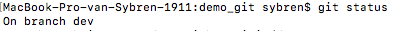
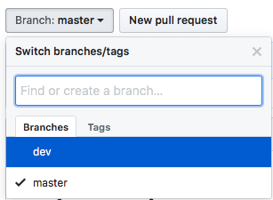

## working with GIT

if you start with the project start to make with a branch

git branch `dev`

to go into the branch use `git checkout dev`

if you do `git status` you will see you are in the dev directory 



to send the dev branch to the other collebraters use `git push origin dev`

you will see unther "branch" on your github in wich branch you are. Now you will see the dev branch and the master



if you want to work in the dev branch use as a other colebrater `git pull origin dev`

to make a new branch `git branch try_hello_world`
to gou in the branch use `git checkout try_hello_world`


you will see

```
Switched to branch 'hallo_world'
```

make a test file `touch trying_hello_world`


add and push it to the server

```
git add trying_hello_world 
git commit -m"trying to septup a hello world application"
```

to go back to dev use `git checkout dev`

steek de aanpassaingen van de hallo_world in de dev use `git merge try_hello_world`


to publich your code.


First to a `git pull origin dev` or `git pull`
if there are changes you need to add and commit them first.


than if nothing is in conflict you can commit and push


if the dev is working. you can send it to the master. 

first go to the master
`git checkout master`

merge the master with the dev
`git merge dev`


add taggs on a version


`git tag v1.0`(v1.0 is variabel)

`git push origin --tags`

with `gut tag -l`you can list up the difrent tags.

if you want to go to the tag. use `git checkout v1.0`


